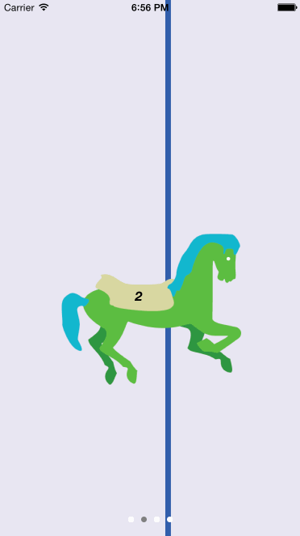

# FZCarousel

## Demo


#### Introduction
FZCarouselCollectionViewDelegate provides a straightforward, lightweight interface for producing an "infinitely" scrolling carousel. 

## Usage

#### Implementing a subclass

Users of this class should begin by subclassing it. Subclasses should handle all UICollectionViewDataSource, UICollectionViewDelegateFlowLayout, and UICollectionViewDelegate methods that need to be overwritten to produce the desired collectionView layout. At minimum, it is expected that users will overwrite -collectionView:cellForItemAtIndexPath:, and an exception will be thrown if this is not the case. 

This class, in turn, will handle all "carousel concerns," which include manipulation and syncing of the data array, page control updates, and, of course, carousel cranking.

#### Standard Configuration
```obj-c
self.carouselCollectionViewDelegate = [FZDemoCarouselCollectionViewDelegate carouselCollectionViewDelegateForCollectionView:self.collectionView dataArray:self.dataArray defaultCrankInterval:2.0f lazyCrankInterval:2.5f];
```

#### Responding to cell selection
```obj-c
self.carouselCollectionViewDelegate.didSelectCellBlock = 
^(UICollectionView *inCollectionView, NSIndexPath *inIndexPath, id inDataForIndexPath)							
{												
	[tmpSelf showSelectionIndicator:YES withData:inDataForIndexPath];
};
```

#### Controlling the carousel
```obj-c
[self.carouselCollectionViewDelegate beginCarousel];
[self.carouselCollectionViewDelegate endCarousel];
```